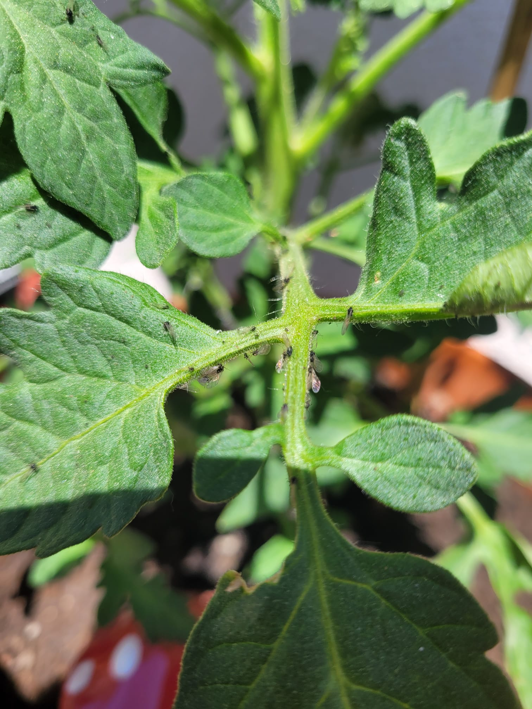

# Sorten
- **Ochsenherztomate** (1 Pflanze)
    - Veredelt
    - Dehner, Stückpreis TODO:
- **Zucker-Tomate Resistent** (1 Pflanze)
    - Gattung: Solanum lycopersicum (rot)
    - Dehner, Stückpreis TODO:

## 31. Mai
Beide Tomaten haben einen starken Befall von Blattläusen. Es sind ausgewachsene "Fliegen" sowie Larven zu entdecken. Es ist sehr wahrscheinlich, dass der Befall schon vor ein paar Tagen begonnen hat und bis jetzt unentdeckt blieb.

